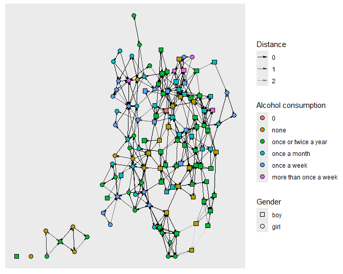
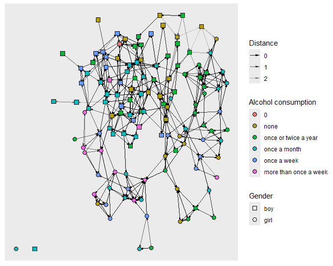
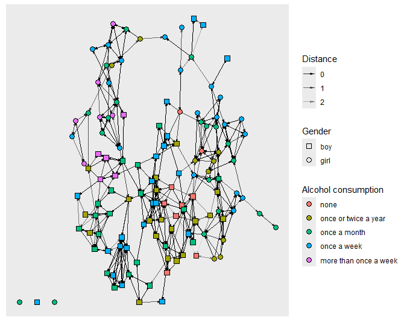
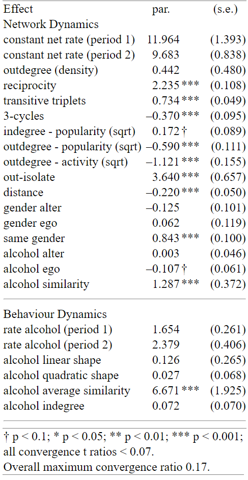

We begin by constructing the `sienaData` object using the dataset. There
are three waves which we put togheter as a `sienaDependent` object, an
additional dependant endogenous actor covariate is the alcohol
consumption. Additionally we have three constant exogenous covariates,
two of which are actor covariates: age and gender, which are put
in`coCovar`objects. The last exogenous covariate is the log of the
distance between actors, as a dyadic covariate this is stored in a
`coDyadCovar` object.

```{r, echo=FALSE}
library(RSiena)
library(sna)
library(parallel)
library(igraph)
library(RColorBrewer)
library(ggraph)

net1 <- as.matrix(read.csv("Glasgow/f1.csv", header = FALSE))
net2 <- as.matrix(read.csv("Glasgow/f2.csv", header = FALSE))
net3 <- as.matrix(read.csv("Glasgow/f3.csv", header = FALSE))

attributes = as.data.frame(read.csv("Glasgow/demographic.csv", header = TRUE))
alcohol_matrix = as.matrix(read.csv("Glasgow/alcohol.csv", header = TRUE))
distance_matrix = as.matrix(read.csv("Glasgow/logdistance.csv", header = FALSE))

net = sienaDependent(array(c(net1,net2,net3), dim = c(129,129,3)))
age = coCovar(attributes$age)
gender = coCovar(attributes$gender)
distance = coDyadCovar(distance_matrix)
alcohol = sienaDependent(array(alcohol_matrix, dim = c(129,1,3)))

data = sienaDataCreate(net, gender, age, distance, alcohol)
data
```

We also plotted the networks using `ggraph`, the code will not be
reported here as its not the focus of the task, but it available in the
full source code. This plots will be used to get an idea of effects may
be important and what is generally happening in the network. The larger
the distance between two actors the more transparent the tie.

{width="677"}

{width="677"}

{width="677"}

### 4.1

The first task is to compute the Jaccard index of the dataset. This is
automatically computed when creating the `sienaData` object. We can see
the result by printing out a report.

```{r, echo=FALSE}
print01Report(data, modelname = "task4_data")
# Exerpt from file output:
# Tie changes between subsequent observations:
#  periods        0 =>  0   0 =>  1   1 =>  0   1 =>  1   Distance Jaccard   Missing
#   1 ==>   2     15827       237       240       208       477     0.304         0 (0%)
#   2 ==>   3     15839       228       209       236       437     0.351         0 (0%)
```

As we can see the Jaccard indices are 0.304 and 0.351. It is recommended
that all indices should be above 0.3 (@Siena_Manual section 2.5). Under
0.3 and there might not be enough informations to explain all changes
happening in the network across time. In our case both the indices are
indeed above 0.3 however the first one (period 1 to 2) only barely so.
This could indicate that there is tendentially little information to
explain all changes. The potential consequences of this will be
discussed later.

### 4.2

It is now time to construct the model. We are given a few hypothesis to
test:

-   H1: Students tend to be friends with popular pupils.
-   H2: Students tend to be friends with students that live in the same
    neighborhood (living nearby).
-   H3: Popular students tend to increase or maintain their level of
    alcohol consumption.
-   H4: Students tend to adjust their alcohol consumption to that of
    their friends.

Additionally we want to control for additional basic effects acting on
both the alcohol behavior and the friendship ties. All of this combined
was too much to estimate at once and the model did not converge, as such
we started by making a simple model, then going through the estimation
procedure until convergence, we then used this simple model as a
starting point for a more complex model by adding more effects and
estimating it again. Some of the models required multiple runs to reach
a satisfying convergence, to automate the process the following function
adapted from @Siena_Manual section 6.3.3 was used:

```{r, echo=FALSE}
#' Run a \code{siena07} algorithm until convergence and export results
#' @param max_iter maximum iteration steps before giving up
#' @param name name of the model, used to make backups
#' @param prevAns previous model to use as a start
fitModel = function(alg, data, effects, max_iter, name = alg$projname, prevAns = NULL, ...)
{
  ############FILE MANAGMENT
  name = paste(name,".bin",sep="")
  if(!dir.exists("task4\\fits")) 
    dir.create(path = "task4\\fits", recursive = TRUE)
  if(!dir.exists("task4\\results")) 
    dir.create(path = "task4\\results", recursive = TRUE)
  results_file = paste(alg$projname,".txt",sep="")
  results_path = paste("task4\\results\\",results_file,sep="")
  ##########################
  
  iter = 0
  print("Begin fitting.")
  out = siena07(alg, data = data, effects = effects, prevAns = prevAns, ...)
  repeat 
  {
    save(out, file = file.path("task4\\fits",name))
    if(file.exists(results_file))
    {
      file.copy(from = results_file, to = results_path, overwrite = TRUE)
      file.remove(results_file)
    }
    iter = iter + 1
    conv = out$tconv.max
    print(paste("Iteration: ", iter, ". Convergence: ", conv, sep = ""))
    if ((conv < 0.25) && (sum(abs(out$tconv)<0.1) == length(out$tconv))) 
    {
      print("Convergence succeded.")
      return(out)
    }
    if (conv > 10) 
    {
      print("Covergence failed.")
      return(NULL)
    }
    if (iter > max_iter) 
    {
      print("Timed out.")
      return(NULL)
    }
    out = siena07(alg, data = data, effects = effects, prevAns = out, ...)
  }
}
```

This function calls `siena07` using the previous interaction as a
starting point until satisfying convergence is reached. Satisfying
convergence is defined as estimates whose absolute t-ratios are all
under 0.1 and the overall maximum convergence ratio is less than 0.25
(@Siena_Manual section 6.3.2). There is some additional code required to
create backups and organize the results but they are not the focus of
the assignment.

We then run a series of models in quick succession adding more and more
effects. Here follow all simpler versions without their outputs and we
omit all the goodness of fit and convergence analysis that was done in
between models, instead we only discuss the final version as that
demonstrated the best fit:

```{r, echo=FALSE}
eff = getEffects(data)
{
  eff = includeEffects(eff, inPopSqrt)
  eff = includeEffects(eff, X, interaction1 = "distance")
  eff = includeEffects(eff, indeg, name = "alcohol", interaction1 = "net")
}

alg0 = sienaAlgorithmCreate(projname = "model0", seed = 37, nsub = 4, n3 = 1000)
model0 = fitModel(alg0, data = data, effects = eff, max_iter = 30,
                  useCluster = TRUE, nbrNodes = 4,   # Parallel computing args
                  returnDeps = TRUE)  # Return simulated networks for gof

{
  eff = includeEffects(eff, egoX, altX, sameX, interaction1 = "gender")
  eff = includeEffects(eff, avSim, name = "alcohol", interaction1 = "net")
}

alg1 = sienaAlgorithmCreate(projname = "model1", seed = 37, nsub = 4, n3 = 1000)
model1 = fitModel(alg1, data = data, effects = eff, max_iter = 30, prevAns = model0,
                  useCluster = TRUE, nbrNodes = 4, returnDeps = TRUE)

{
  eff = includeEffects(eff, transTrip, cycle3)
  eff = includeEffects(eff,outActSqrt,outPopSqrt)
}

alg2 = sienaAlgorithmCreate(projname = "model2", seed = 37, nsub = 4, n3 = 1000)
model2 = fitModel(alg2, data = data, effects = eff, max_iter = 30, prevAns = model1,
                  useCluster = TRUE, nbrNodes = 4, returnDeps = TRUE)

{
  eff = includeEffects(eff, outIso)
  eff = includeEffects(eff, name = "net", altX, egoX, simX, interaction1 = "alcohol")
}

alg3 = sienaAlgorithmCreate(projname = "model3", seed = 37, nsub = 4, n3 = 1000)
model3 = fitModel(alg3, data = data, effects = eff, max_iter = 30, prevAns = model2,
                  useCluster = TRUE, nbrNodes = 4, returnDeps = TRUE)

```

The last model has quite a few effects in place, let's go through them:

-   outdegree(density) and reciprocity: this self-explanatory effects
    are a must have for most models, they are added automatically with
    `getEffects(eff)`
-   `inPopSqrt`: indegree popularity, this was added to test H1, we use
    the square root variant as @Siena_Manual (section structural
    effects) states that: " this often works better in practice than the
    raw popularity effect"
-   `X, interaction1 = "distance"`: the effect of distance on forming
    ties, required to test H2
-   `indeg, name = "alcohol", interaction1 = "net"`: effect of the
    indegree on the alcohol behavior, required to test H3
-   `eff, egoX, altX, sameX, interaction1 = "gender"`: basic effects of
    the gender covariate. We test if either your own gender or the
    gender of the other ineherently have an effect on tie formation
    (`egoX` and `altX`), as well as gender homophily (`sameX`)
-   `avSim, name = "alcohol", interaction1 = "net"`: wheter the average
    of the alcohol behavior of the neighbours of an actor affects its
    alcohol behavior. Required to test H4 - `transTrip,     cycle3`:
    both used to test the effects of transitivity. Transitive triplets
    tend to be evidence of a "hierarchical" structure while 3 cycles
    tend be evidence of an "egalitarian" structure
-   `outActSqrt`: the outdegree activity effect, therefore wheter the
    outdegree of an actor influences tie formation *from* that actor
-   `outPopSqrt`: the outdegree popularity, wheter the outdegree of an
    actor influences tie formation *towards* that actor. The alternative
    would be the indegree activity, however they collinear so only one
    should be used. The reasoning behind this choice is that,
    potentially, more active actors could be perceived as "friendly" as
    they reach to reach out to people often, and that other actors might
    see this friendliness attractive for tie formation
-   `outIso`: outdegree isolate, the attractiveness of having an
    outdegree of 0. This was chosen because upon visual inspection of
    the network we saw a few isolate actors, as well as a new one
    appearing on wave 2, so we decided to introduce at least one isolate
    effect
-   `name = "net", altX, egoX, simX, interaction1 = "alcohol"`: some
    basic additional effects of the alcohol behaviour on tie formation.
    We test if your or the others alcohol consumption has importance
    (`egoX` and `altX`), additionally we also test for alcohol homophily
    (`simX`).

### 4.3

After estimating the final model we can analyse its convergence and
goodness of fit. For the goodness of fit we use the same auxiliary
statistics used in the lecture: in- and outdegree distribution, triad
census and geodesic distance distribution. Using the following code the
violin plots are created and plotted (the original code has additional
file management code added to it, it was omitted for readability):

```{r, echo=FALSE}
# Adapted from the "Practical 3: Estimating and interpreting SAOMs" lecture

  cl <- makeCluster(4) # with 4 workers
  # Indegree distribution
  gofId <- sienaGOF(
    model3,
    verbose = FALSE,
    varName = "net", IndegreeDistribution,
    cluster = cl
  )
  plot(gofId)
  
  # Outdegree distribution
  gofOd <- sienaGOF(
    model3,
    verbose = FALSE,
    varName = "net", OutdegreeDistribution,
    cluster = cl
  )
  plot(gofOd)
  
  # Triad census
  gofTC <- sienaGOF(
    model3,
    verbose = FALSE,
    varName = "net", TriadCensus,
    cluster = cl
  )
  plot(gofTC, scale = TRUE, center = TRUE)
  
  # Geodesic distance
  GeodesicDistribution <- function(
    i, data, sims, period, groupName,
    varName, levls = c(1:5, Inf), cumulative = TRUE) {
    x <- networkExtraction(i, data, sims, period, groupName, varName)
    require(sna)
    a <- sna::geodist(symmetrize(x))$gdist
    if (cumulative) {
      gdi <- sapply(levls, function(i) {
        sum(a <= i)
      })
    }
    else {
      gdi <- sapply(levls, function(i) {
        sum(a == i)
      })
    }
    names(gdi) <- as.character(levls)
    gdi
  }
  gofGD <- sienaGOF(
    model3,
    verbose = FALSE,
    varName = "net", GeodesicDistribution
  )
  plot(gofGD)
  gofBeh <- sienaGOF(
    model3,
    verbose = FALSE,
    varName = "alcohol", BehaviorDistribution,
    cluster = cl
  )
  plot(gofBeh)
  stopCluster(cl)

```

The results of each model are exported as txt files however we can
create html summary of the output by running (a screenshot of said
summary follows right after):

```{r, echo=FALSE}
siena.table(model3, type = "html", sig = TRUE)
```

{width="231" height="453"}

As we can see both the t-ratios and the overall maximum convergence
ratio satisfy our previously stated conditions for a satisfying
convergence.

The goodness of fit on the other hand is poor. One of the criteria for a
good fit is a p-value of auxiliary statistics (seen at the bottom of the
plots) must be at least 0.05 (@Siena_Manual see section 5.15.2) to be
considered a good fit. Unfortunately the triad census and geodesic
distance distribution have a p-value of 0 therefore very poor, outdegree
distribution with 0.044 is better than 0 but still suboptimal. Indegree
distribution and the alcohol behaviour on the other hand show excellent
fit with 0.761 and 0.536 respectively. We will discuss later how the fit
might be improved but for now we will move towards interpreting the
estimates. Due to the poor fit however they should all be taken with a
grain of salt as it may not represent reality.

We will only discuss the significant estimates here, the hypothesis will
be discussed in the next section. The first estimate to show
significance is reciprocity, which has a large positive value therefore
showing a strong tendency of actors to reciprocate incoming ties, this
is to be expected in real friendship networks. We also have evidence of
transitive triplets and 3-cycles. Transitivity is also to be expected in
real friendship networks. The positive estimate in transitive triplets
and the negative in 3-cycles hint towards a certain hierarchical
structure in the network however the values are relatively small so the
effect may not be so strong. Outdegree popularity surprisingly has a
negative, based on the original reason for implementing this effect,
this would mean that active actors and therefore theoretically
friendlier, tend to attract less ties. The absolute value isn't
particularly large but it may still hint towards a more complex dynamic
that goes beyond just being friendly. Outdegree activity also shows a
negative estimate, this mean each additional ties an actor wants to
create "costs" him more and more. This could be explained by the fact
that a real person has limited resources and time to spend with people,
as such it becomes increasingly difficult to sustain ties with large
amounts of people. Out-Isolate is a extremely large positive estimate,
which could point towards difficulty in getting out of isolation but
also towards a tendency of isolating one self if an actor has only one
tie. To differentiate this two phenomenons on would have to split the
out isolate effect into an evaluation-endowment or creation-endowment
pair, we tried to do so but the model did not converge, there may be
other effects that are near-collinear interfering with the estimation or
evaluation and endowment are collinear with each other, we did not
explore much further but we will discuss it later in the improvements of
section 4.6. We also have a negative estimate for distance, a negative
value means that with increasing distance it becomes increasingly less
attractive to form a tie, this makes sense in a real context. We have a
positive estimate in the same gender effect pointing towards gender
homophily, this is a common phenomenon in a school scenarios so this is
also expected. Alcohol similarity shows a large positive estimate,
meaning that there is a tendency towards alcohol homophily. Considering
that drinking is often a social activity, it might make sense that two
actors that drink at the same frequency maybe find it pleasant to drink
with others and therefore create bonds. One last words before going into
behavioural dynamics. One surprising estimate is the density effect. It
shows no significance and a positive value, this is unusual as real
networks tend to be sparse and therefore have a negative and significant
estimate. This might be a consequence of the poor fit but there might be
more effects at play.

For behavioural dynamics the only significant estimae is the alcohol
average similarity. Showing an exeptionally large positive value this
shows a strong tendency to adjust one's alcohol consumption based on
one's friends. This is confirmed by visual inspection of the network,
indeed a lot of actors increase their alcohol consumption over the
course of the waves, with the last one having to actors with value 0 and
the number of actors that drink more than once a week doubling over the
course of the study.

### 4.4

We will now discuss the hypothesis and whether they have been confirmed
or not. We will only explain the estimates there not discussed in the
previous section.

-   H1: there is little evidence towards indegree popularity. The model
    estimated a positive value of 0.172 with a significance of 0.05 \< p
    \< 0.1, as such we do not deem it significant enough to reject the
    null hypothesis. If however one was satisfied with its significance,
    the positive value would support the H1 but it would be a farily
    weak effect due to the low value.

-   H2: this hypothesis has indeed been confirmed. With a distance
    effect having an estimate of -0.220 and p \< 0.001 we can reject the
    null hypothesis.

-   H3: there is little evidence supporting this hypothesis as the
    alcohol indegree effect reported an insingnificant estimate of
    0.072, as such we cannot reject the null hypothesis.

-   H4: this hypothesis was confirmed by the large, positive and
    significant estimate of alcohol average similarity of 6.671 and p \<
    0.001. This is indeed sufficient to reject the null hypothesis and
    confirm H4.

### 4.5

We have evidence for both selection and influence processes. For the
selection side we have a significant estimate in the alcohol similarity
effect of 1.287 with p \< 0.001. We also tried alcohol ego and alter
effects, but the estimates showed little significance so do not have
enough evidence for them. For the influence side we have strong support
for the alcohol average similarity effect as discussed previously.

### 4.6

As stated previously our model only managed to succeed in a poor fit. We
however ran many different iterations which we eventually discarded. For
example we attempted to introduce endowment version of already present
effects but in most cases the model resulted in all estimates becoming
insignificant because the standard deviations were increased
substantially, a potential reason is that some form of near-collinearity
has happened, such an example was the previously mentioned attempt at
introducing a out isolated endowment effect. One potential solution
would be to remove some of the insignificant effects one at a time by
looking at the covariance matrix to asses which effects seem to show the
largest collinearity. That may affect the significance of other effects
which is the reason why it must happen one at a time. From visual
inspection it also seems like the network is more dense in the regions
with a large amount of boys, becoming more sparse in regions with girls.
This may hint towards some gender related differences in behaviour that
could be modeled using effect interactions, for example transitive
triplets x gender to try and simulate this apparent tendency of boys to
form a big cluster. In previous versions we also tried the homogenous
covariate x transitive triplet and different covariate x transitive
triplet effects but none of them showed significant estimates so we may
be on the wrong track. We also tried age related effects but none of
them were significant, which makes sense as the age differences are of a
few months or a year at best. We could also attempt to integrate rate
related effects, for example one connecting alcohol consumption and
rate, on the grounds that a higher consumption may for example
facilitate making ties because of its consumption often being a social
event or instead causing ties to be removed because of problematic
behaviors caused by its consumption.

### 4.7

SAOMs's strength and advantage over ERGMs is the ability to test
hypothesis that require observing the evolution of either the network of
the actors properties through time. Two examples of hypothesis we might
want to test on the given network and alcohol data could be whether one
specific gender has the tendency to increase its alcohol consumption. To
test it we simply need to add the "effFrom" effect of Siena to the model
on the alcohol behavior, this way the contribution of gender will be
taken into account in its evolution. The second example could be whether
isolate actors have the tendency to increase alcohol consumption. This
requires us to integrate the "outIsolate" effect on the alcohol
behavior.
